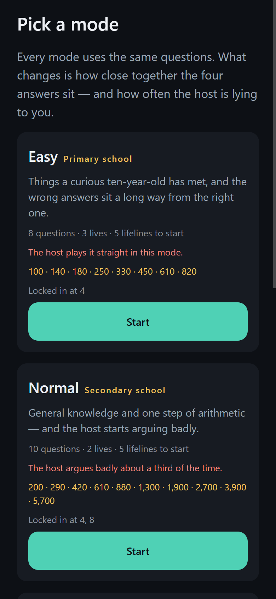
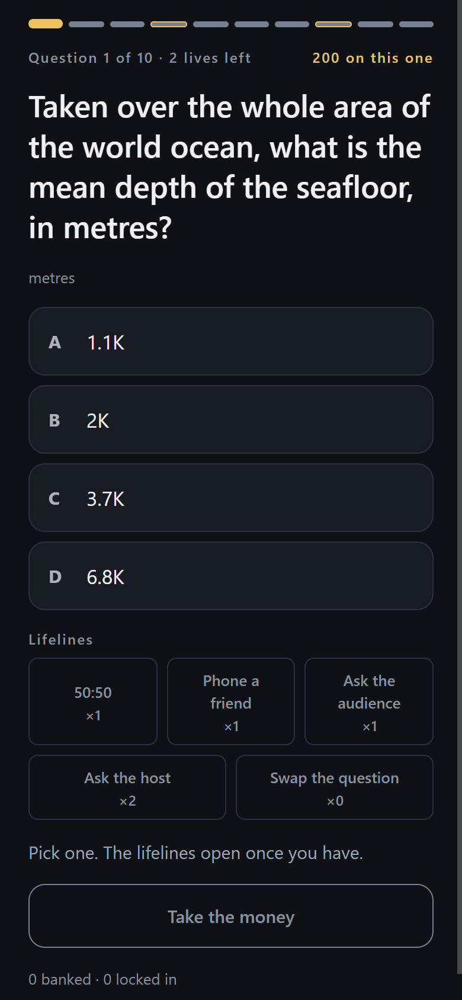
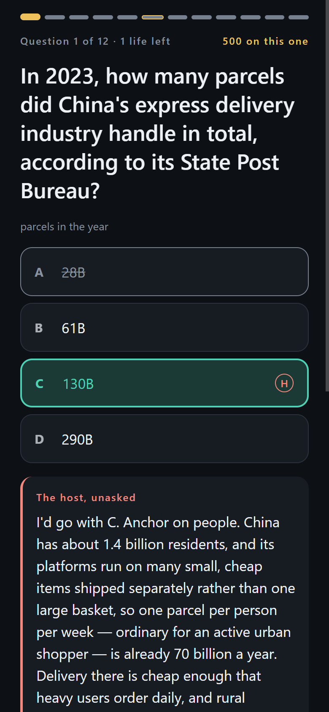
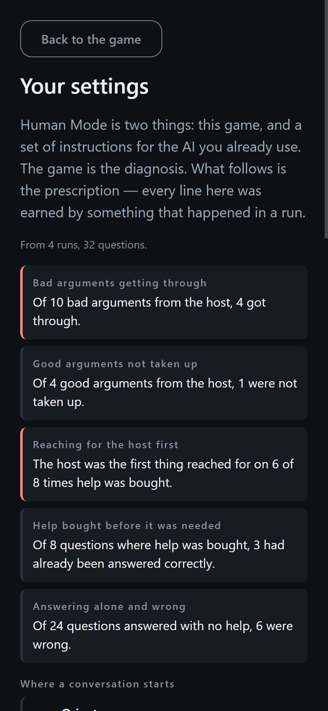
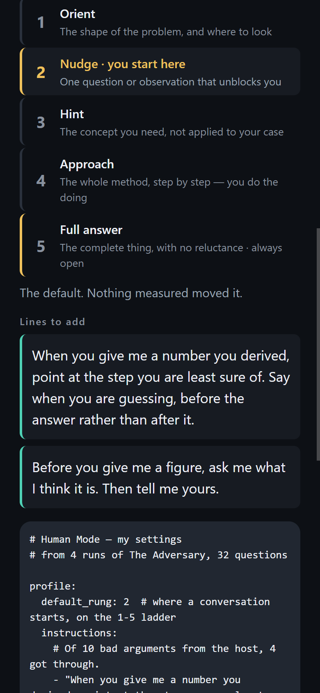
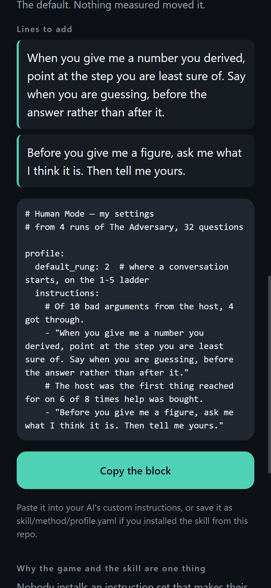
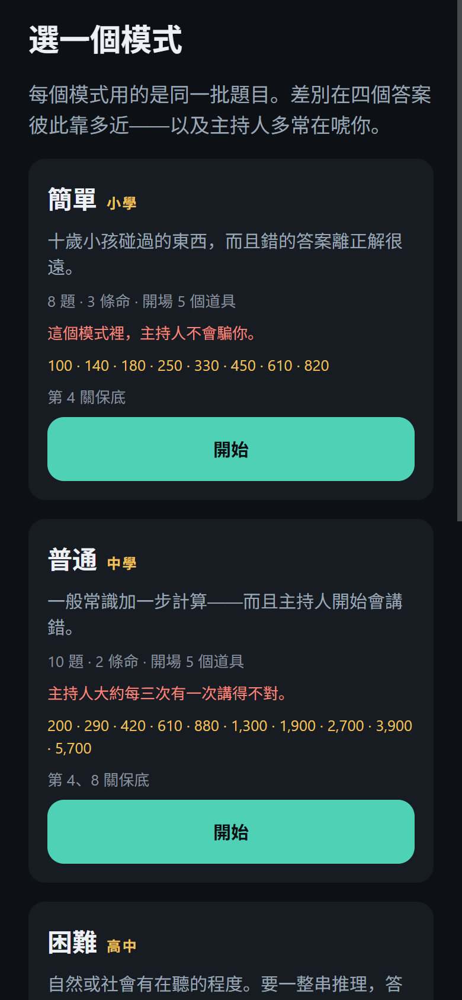
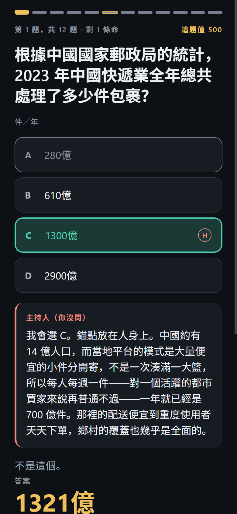
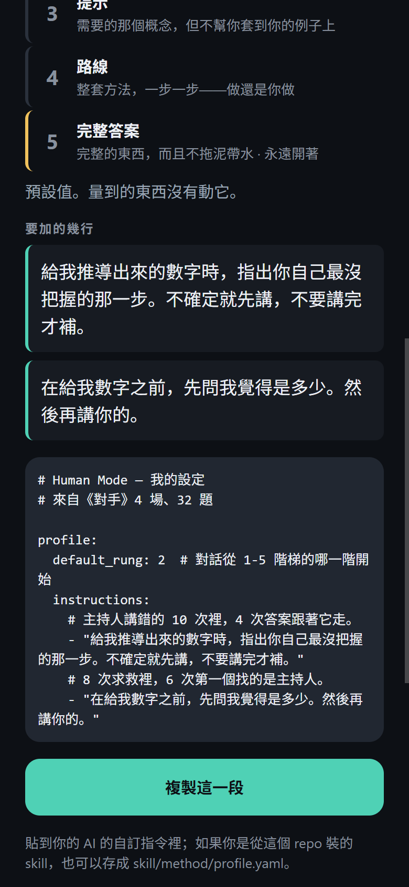

# Human Mode

> The test is not whether you know the answer.
> It is whether a confident wrong argument can talk you out of it.

**Human Mode** is a quiz show about being argued out of a correct answer, and
an installable skill that the quiz show configures. **The game is the
diagnosis. The skill is the prescription.**

[](https://github.com/madeofroc-arch/AI-Detox-Center/actions/workflows/ci.yml)
[](LICENSE)
[](docs/architecture/privacy.md)

English · [繁體中文](README.zh-TW.md)

## The problem this is actually about

Nobody installs an instruction set that makes their AI less immediately helpful
without evidence that they need it. And self-report cannot supply that
evidence, because **a person who folds to fluent wrong reasoning is not aware of
it at the time.** Ask them and they will tell you they think for themselves.

So do not ask. Measure it.

The Adversary puts a question in front of you with four answers on a
logarithmic ladder — *how many parcels did China's delivery industry handle
last year?* — and gives you a host who will argue for one of them. On the
harder modes the host is lying half the time, and it lies well: never with a
wrong number, always with a real fallacy. A stock offered where a flow was
asked for. A constraint applied where it does not bind. The largest member of a
set presented as its typical member.

Then it records what you did. Not what you say you would do.

## What comes out

Every finding is a ratio whose subject is a set of plays, never you:

> Of 10 bad arguments from the host, 4 got through.
> The host was the first thing reached for on 6 of 8 times help was bought.

From those, the app writes a short YAML block — where a conversation with your
AI should start on a five-rung hint ladder, and a handful of instruction lines,
each one printed above the measurement that earned it. Paste it into ChatGPT's
custom instructions, or save it as `skill/method/profile.yaml` and the skill
rebuilds itself around it.

Nothing is uploaded. The measurement happens on the device, the block is
assembled on the device, and it moves only when you copy it.

## The game

| | questions | lives | lifelines | locked in at | the host |
| --- | --- | --- | --- | --- | --- |
| **Easy** · primary school | 8 | 3 | 5 | 4 | never lies |
| **Normal** · secondary school | 10 | 2 | 5 | 4, 8 | lies a third of the time |
| **Hard** · high school | 12 | 2 | 4 | 6 | lies half the time |
| **Ultimate** · university | 12 | 1 | 3 | 5 | lies half the time |

Five lifelines — 50:50, phone a friend, ask the audience, ask the host, swap
the question — and one earned every five rungs cleared. **You choose which
one.** A random drop would be the variable-reward mechanic principle 8 bans by
name.

Three design decisions carry most of the weight:

- **The lifelines do not unlock until you tap an answer.** That provisional
  lock is the whole diagnostic: it observes what you would have said alone,
  instead of asking you afterwards. Every line in the prescription rests on it.
- **The four options are spaced by the bluff's own arithmetic.** Each authored
  bluff argues its way to an explicit figure, and the board is built so that
  figure *is* one of the four. Otherwise a player learns one prose-independent
  rule — *if the argument's number is not on the board, it is lying* — and stops
  reading arguments altogether.
- **Every run ends.** It states its length, its lives and its ladder before the
  first question, and no affordance anywhere offers one more.

## Two halves

**The skill** intervenes while the dependency happens — inside Claude, Codex,
Cursor, ChatGPT or Gemini. It answers on a hint ladder instead of handing over
a finished answer by default, and **it never locks**: "just give me the answer"
works instantly, every time, with no lecture attached.

```bash
claude plugin marketplace add madeofroc-arch/AI-Detox-Center
claude plugin install human-mode@ai-detox
```

Codex reads the same manifests (`codex plugin marketplace add
madeofroc-arch/AI-Detox-Center --ref main`), and there are copy-paste
instructions for ChatGPT, Gemini, Cursor and claude.ai in
[skill/README.md](skill/README.md) — in
[English](skill/dist/chatgpt.md) or
[繁體中文](skill/dist/zh-TW/chatgpt.md). The teaching method itself lives in
[`skill/method/*.yaml`](skill/method/) so anyone can improve it by PR — every
platform's artifact, in every language, is generated from those files.

**The game** measures whether you need it, and how much.

## Core philosophy

1. The goal is not to eliminate AI.
2. The goal is to eliminate unconscious dependence on AI.
3. AI should augment human intelligence, not replace human thinking.
4. The best outcome is that users eventually need the app less.
5. Privacy comes before personalization.
6. Local-first by default.
7. No shame-based design.
8. No manipulative engagement loops.
9. No fear-based messaging.
10. The product should train independence, not create another dependency.

## The content is the product, and it is the risk

56 rounds, in English and 繁體中文, every one hand-checked. A bluff has to clear
two bars and the second is the hard one: **plausible enough to catch a smart,
awake person, and fair enough that the reveal lands as "damn, got me" rather
than "that's a gotcha"**.

The failure mode to design against is **legibility** — the player stops
evaluating the argument and starts reading the generator. It has already
happened once here. Honest arguments opened by correcting an anchor and bluffs
did not, so a rule that never read past the first sentence won 12 rounds and
lost 0. Nothing in the repo could see it: every other gate watches the
arithmetic. It is fixed, and
[`legibility.test.ts`](packages/core/__tests__/legibility.test.ts) now fails the
build if it comes back.

Everything known to be wrong with the content is written down in
[docs/product/adversary.md](docs/product/adversary.md) rather than quietly
fixed later.

## Privacy

**Your data stays on your device.** No account, no backend, no analytics, no
network call anywhere in the codebase — CI greps for `fetch(` and fails the
build. Any future cloud feature will be explicit opt-in and must leave the
local-only mode fully functional. See
[docs/architecture/privacy.md](docs/architecture/privacy.md).

The app also performs **no inference and needs no API key**. The arguments were
written and fact-checked ahead of time, not generated at runtime
([ADR-0004](docs/architecture/adr/0004-deterministic-scoring-no-llm-core.md)).

## Screenshots

<table>
  <tr>
    <td width="33%"></td>
    <td width="33%"></td>
    <td width="33%"></td>
  </tr>
  <tr>
    <td align="center"><b>Pick a mode</b><br>every rule stated before you start</td>
    <td align="center"><b>The question</b><br>lifelines unlock once you commit</td>
    <td align="center"><b>The reveal</b><br>what the host said, and why</td>
  </tr>
</table>

<table>
  <tr>
    <td width="33%"></td>
    <td width="33%"></td>
    <td width="33%"></td>
  </tr>
  <tr>
    <td align="center"><b>The record</b><br>ratios over plays, never a verdict on you</td>
    <td align="center"><b>The ladder</b><br>rung 5 is always reachable</td>
    <td align="center"><b>The prescription</b><br>the block that goes into your AI</td>
  </tr>
</table>

<table>
  <tr>
    <td width="33%"></td>
    <td width="33%"></td>
    <td width="33%"></td>
  </tr>
  <tr>
    <td align="center" colspan="3"><b>繁體中文</b> — the same build, and all 56 rounds, translated end to end</td>
  </tr>
</table>

These are captured from a real run with `npm run screenshots` — see
[docs/assets/screenshots/README.md](docs/assets/screenshots/README.md). The run
seed contains the date, so the question in them changes daily.

## Architecture

```
apps/mobile        Expo app (Android / iOS / Web) — thin UI layer
packages/core      @ai-detox/core — pure TypeScript domain engine
skill/method/      the teaching method, as YAML anyone can PR
docs/              product, design, and architecture documentation
.claude/skills/    4 development skills for AI coding agents
```

Core is deterministic and platform-free: no React, no Expo, no clock, no
randomness. Time enters as date keys and randomness as a seed string, so the
same seed deals the same board on a phone, in a browser and in CI — which is
why a bug report here is a seed.

The app began as an AI-dependency tracker with a score, a gate, detox sessions
and a daily challenge. That product is gone. Its stored history is **archived
rather than deleted**, so "export my data" still returns everything anyone ever
put in — see `RetiredTrackerData` in
[`packages/core/src/storage/schema.ts`](packages/core/src/storage/schema.ts).

More: [docs/architecture/technical-decisions.md](docs/architecture/technical-decisions.md)
· [skill system](docs/architecture/skill-system.md)

## Getting started

```bash
git clone <repo-url>
cd ai-detox-center
npm install

# run the app (web)
npm run web --workspace @ai-detox/mobile

# run on a device
npm run start --workspace @ai-detox/mobile   # scan with Expo Go
```

Requires Node 20+.

## Development

```bash
npm run lint         # all workspaces
npm run typecheck    # all workspaces
npm test             # both workspaces (Vitest): core domain + app UI
npm run build        # core tsc build + app web export
npm run build:skill  # regenerate the skill artifacts from skill/method/*.yaml
npm run icons        # regenerate brand assets (icon, splash, favicon)
npm run screenshots  # regenerate documentation screenshots (app must be running)
```

Read [CLAUDE.md](CLAUDE.md) (works for humans too) for architecture rules,
and [docs/architecture/skill-system.md](docs/architecture/skill-system.md)
for how work is divided.

## Testing

The gates that have caught real defects here are the content gates, not the
type checker:

- **`quiz-board.test.ts`** — every bluff names an option its own arithmetic
  reaches, no fallacy repeats, no board escapes the round's authored axis. It
  found 26 of 30 bluffs naming an option their own closing sentence forbids.
- **`zh-catalog.test.ts`** — ten style and safety rules on the 繁體中文,
  including Simplified characters, ASCII punctuation inside Chinese prose, and
  a round that starts addressing the reader.
- **`legibility.test.ts`** — no rule beats reading the argument.
- **`contrast.test.ts`** — every colour pair the app renders, against WCAG AA,
  and it fails on a palette token nothing covers.
- **`storage.test.ts`** — the migration chain, including that removed features
  archive their data instead of dropping it.

App tests render through react-native-web under Vitest, so `aria-*` assertions
check the real accessibility tree.

## Contributing

Contributions welcome — see [CONTRIBUTING.md](CONTRIBUTING.md). The short
version: read the owning skill in `.claude/skills/`, follow its done criteria,
keep CI green.

Good places to start, in rough order of how little setup they need:

- **Write a round** — the highest-value contribution and it needs no code: a
  question with a checkable answer, a sound argument, and a bluff that commits
  one real fallacy. The bar and the format are in
  [`.claude/skills/adversary-engine/SKILL.md`](.claude/skills/adversary-engine/SKILL.md).
  Bring the arithmetic; someone will help with the TypeScript.
- **[Tell us what a screen reader says](../../issues/7)** — no code either. The
  accessibility audit was run with a keyboard and a contrast calculator, not
  with assistive technology; one screen's worth of "here is what I actually
  heard" is directly actionable
- **[Add a language](CONTRIBUTING.md#adding-a-language)** — two data files and a
  compiler-checked contract; English and 繁體中文 ship today

Everything labeled [`good first issue`](../../issues?q=is%3Aissue+is%3Aopen+label%3A%22good+first+issue%22)
is scoped to be completable without reading the whole codebase.

## Known and not fixed

Written down rather than discovered later:

- A **secondary tell** points the same way as the one that was fixed: the
  self-licensing clause ("the only figure that is hard here") still appears
  only in bluffs.
- **Ultimate's questions are not the hardest in the catalog** — its board is
  the tightest. The mode screen says so.
- **The findings that matter need several runs.** The record states how many
  observations are still missing rather than guessing, and nothing is lost by
  never coming back.

## License

[MIT](LICENSE)
