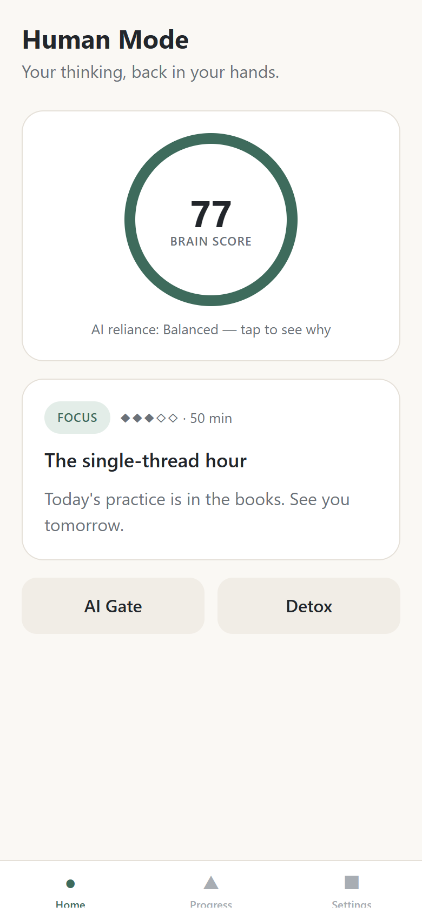
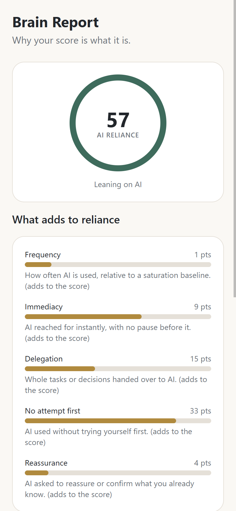
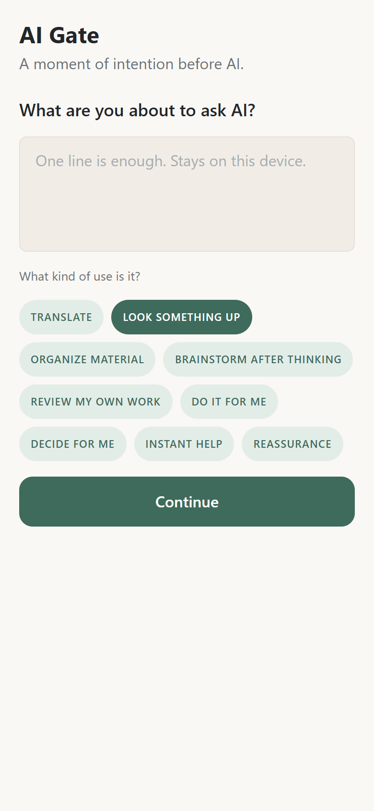
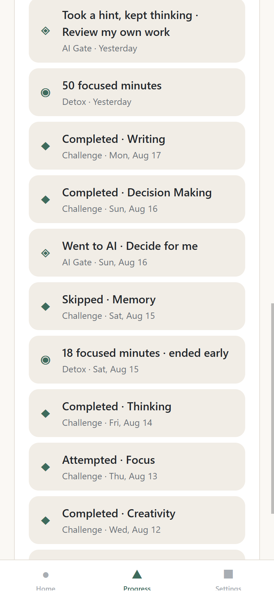

# Human Mode — AI Detox Center

> Detoxing from AI is not about not using AI.
> It is about not letting AI replace your brain.

**Human Mode** is an open-source app for **AI dependency management and
independent thinking training**. AI should augment human thinking, not
replace it.

[](https://github.com/madeofroc-arch/AI-Detox-Center/actions/workflows/ci.yml)
[](LICENSE)
[](docs/architecture/privacy.md)

## What is Human Mode?

Most tools treat "too much AI" as a screen-time problem and reach for
blockers. Human Mode disagrees: the problem is not how *much* you use AI —
it is the quiet behavioral shift from

```
Think -> Try -> Get Stuck -> Hint -> Think Again -> Solve -> Reflect
```

to

```
Question -> AI -> Copy -> Next Question
```

Human Mode measures that shift honestly, inserts a calm moment of intention
before you reach for AI, and retrains the human capabilities that atrophy
first — thinking, writing, memory, decision making, focus.

## Why does it exist?

Because the people who use AI the most are the first to notice their own
thinking getting outsourced — and the tools they are offered are either
abstinence apps or engagement machines. Human Mode is neither. It is built
to make itself less necessary.

## Core philosophy

1. The goal is not to eliminate AI.
2. The goal is to eliminate unconscious dependence on AI.
3. AI should augment human intelligence, not replace human thinking.
4. The best outcome is that users eventually need the app less.
5. Privacy comes before personalization.
6. Local-first by default.
7. No shame-based design.
8. No manipulative engagement loops.
9. No fear-based messaging.
10. The product should train independence, not create another dependency.

## Features (MVP)

- **AI Dependency Score** — deterministic, transparent, config-driven; built
  from behavior patterns (did you try first? who decided?), never from raw
  usage time. Heavy but deliberate use scores low by design. Every score comes
  with a per-factor breakdown explaining how it was reached.
- **AI Gate** — a self-directed pause before using AI: name your intention,
  optionally attempt first for three minutes, then choose. The gate never
  blocks and never shames.
- **Detox Mode** — focused work blocks without AI. Ending early is data,
  not defeat.
- **Daily Human Challenge** — one challenge per day across nine
  capabilities (Thinking, Creativity, Writing, Memory, Decision Making,
  Problem Solving, Communication, Learning, Focus), with adaptive
  difficulty.
- **Reflection** — short optional prompts that turn experience into
  awareness.
- **Progress & Brain Report** — additive progress records and a score
  breakdown that always explains itself.
- **Privacy controls** — one-tap JSON export and full deletion.

## Privacy

**Your thinking data stays on your device by default.** No account, no
backend, no analytics, no network calls anywhere in the MVP codebase. Any
future cloud feature will be explicit opt-in and must leave the local-only
mode fully functional. See
[docs/architecture/privacy.md](docs/architecture/privacy.md).

## Architecture

```
apps/mobile        Expo app (Android / iOS / Web) — thin UI layer
packages/core      @ai-detox/core — pure TypeScript domain engine
docs/              product, design, and architecture documentation
.claude/skills/    5 development skills for AI coding agents
```

The core engine is deterministic and works with **no LLM API at all**:
scoring, gate, detox, challenges, XP, progress, reflection, and storage are
all AI-independent by architecture (see
[ADR-0004](docs/architecture/adr/0004-deterministic-scoring-no-llm-core.md)).

More: [docs/architecture/technical-decisions.md](docs/architecture/technical-decisions.md)
· [skill system](docs/architecture/skill-system.md)

## Screenshots

<table>
  <tr>
    <td width="25%"></td>
    <td width="25%"></td>
    <td width="25%"></td>
    <td width="25%"></td>
  </tr>
  <tr>
    <td align="center"><b>Home</b><br>your score, today's practice</td>
    <td align="center"><b>Brain Report</b><br>every score explains itself</td>
    <td align="center"><b>AI Gate</b><br>a pause, never a wall</td>
    <td align="center"><b>Progress</b><br>a record that only adds up</td>
  </tr>
</table>

The calm, paper-and-ink "Quiet Mind" design system is documented in
[docs/design/design-system.md](docs/design/design-system.md). These images are
generated from demo data with `npm run screenshots` — see
[docs/assets/screenshots/README.md](docs/assets/screenshots/README.md).

## Getting started

```bash
git clone <repo-url>
cd ai-detox-center
npm install

# run the app (web)
npm run web --workspace @ai-detox/mobile

# run on a device
npm run start --workspace @ai-detox/mobile   # scan with Expo Go
```

Requires Node 20+.

## Development

```bash
npm run lint         # all workspaces
npm run typecheck    # all workspaces
npm test             # core unit tests (Vitest)
npm run build        # core tsc build + app web export
npm run icons        # regenerate brand assets (icon, splash, favicon)
npm run screenshots  # regenerate documentation screenshots (app must be running)
```

Read [CLAUDE.md](CLAUDE.md) (works for humans too) for architecture rules,
and [docs/architecture/skill-system.md](docs/architecture/skill-system.md)
for how work is divided.

## Testing

Domain logic lives in `packages/core` and is fully unit-tested — scoring
determinism, gate/detox state machines, challenge selection, streak/XP, and
storage migrations. UI-level tests are a Phase 2 roadmap item.

## Contributing

Contributions welcome — see [CONTRIBUTING.md](CONTRIBUTING.md). The short
version: read the owning skill in `.claude/skills/`, follow its done criteria,
keep CI green.

Good places to start, in rough order of how little setup they need:

- **[Propose a Human Challenge](../../issues/1)** — no code at all; fill in a form
- **[Run the accessibility checklist](../../issues/4)** — never yet executed against the built app
- **[Add UI tests for the app](../../issues/2)** — the largest coverage gap in the repo
- **[i18n + zh-TW](../../issues/3)** — half engineering, half careful writing

Everything labeled [`good first issue`](../../issues?q=is%3Aissue+is%3Aopen+label%3A%22good+first+issue%22)
is scoped to be completable without reading the whole codebase.

## Roadmap

See [docs/product/roadmap.md](docs/product/roadmap.md). Highlights: richer
reports, i18n (zh-TW first), opt-in OS-level gate entry points, community
challenge packs. Never on the roadmap: ads, data sales, engagement
mechanics, surveillance features.

## License

[MIT](LICENSE)
