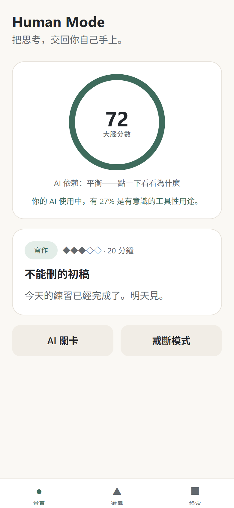
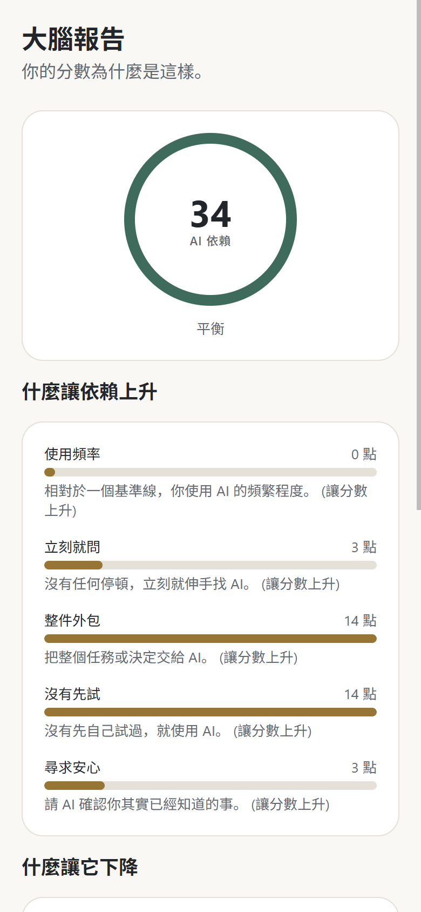
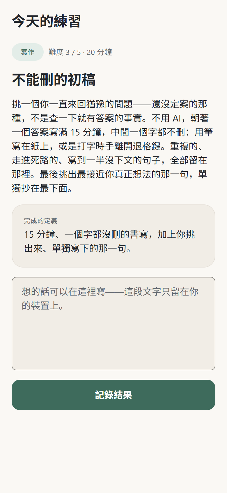
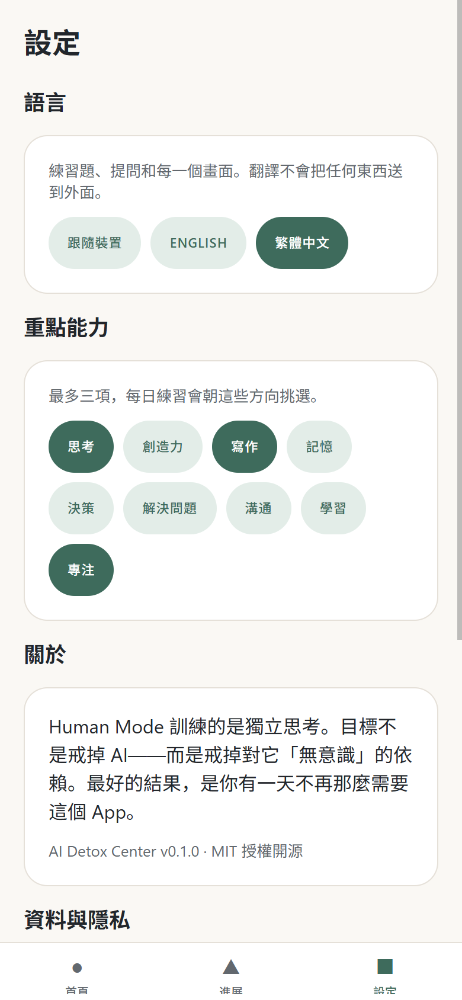

# Human Mode — AI Detox Center

> 戒 AI，不是不用 AI，
> 而是不讓 AI 取代你的大腦。

**Human Mode** 是一個開源的 **AI 依賴管理與獨立思考訓練** App。
AI 應該增強人的思考，而不是取代它。

[](https://github.com/madeofroc-arch/AI-Detox-Center/actions/workflows/ci.yml)
[](LICENSE)
[](docs/architecture/privacy.md)

[English](README.md) · 繁體中文

## 這是什麼？

多數工具把「AI 用太多」當成螢幕使用時間的問題，然後拿出封鎖器。
Human Mode 不這麼認為：問題不在於你用了「多少」AI，而在於那個安靜發生的行為轉變——從

```
想 -> 試 -> 卡住 -> 提示 -> 再想 -> 解決 -> 回顧
```

變成

```
問題 -> AI -> 複製 -> 下一題
```

Human Mode 誠實地量測這個轉變，在你伸手找 AI 之前放進一個平靜的停頓，
並且重新訓練那些最先萎縮的人類能力——思考、寫作、記憶、決策、專注。

## 為什麼需要它？

因為用 AI 用得最多的人，也最先察覺自己的思考正在被外包出去——
而他們能拿到的工具，不是戒斷 App，就是黏著度機器。
Human Mode 兩者都不是。它被設計成讓自己越來越不必要。

## 核心理念

1. 目標不是戒掉 AI。
2. 目標是戒掉對 AI 的「無意識」依賴。
3. AI 應該增強人的智能，而不是取代人的思考。
4. 最好的結果，是使用者最終不再那麼需要這個 App。
5. 隱私優先於個人化。
6. 預設在本機（local-first）。
7. 不使用羞辱式設計。
8. 不使用操弄性的黏著迴圈。
9. 不使用恐懼行銷。
10. 產品應該訓練獨立，而不是製造另一種依賴。

## 兩種使用方式

**Skill（技能）** 在依賴正在發生的當下介入——在 Claude、Codex、Cursor、
ChatGPT 或 Gemini 裡面。它預設用「提示階梯」回答你，而不是直接把完成品交給你；
而且它永遠不會鎖死你：「直接給我答案」隨時有效。

```bash
claude plugin marketplace add madeofroc-arch/AI-Detox-Center
claude plugin install human-mode@ai-detox
```

Codex 讀同一份 manifest（`codex plugin marketplace add
madeofroc-arch/AI-Detox-Center --ref main`）；ChatGPT、Gemini、Cursor 和
claude.ai 的「複製貼上」說明在 [skill/README.md](skill/README.md)，
中文版指令在 [`skill/dist/zh-TW/`](skill/dist/zh-TW/)——
你應該看得懂你貼進去的東西。

教學方法本身放在 [`skill/method/*.yaml`](skill/method/)，任何人都可以用 PR 改進它——
每個平台、每個語言的產出物都是從那些檔案生成的。翻譯是「疊加層」而不是分支：
每一條規則都用 id 對回英文原文，少翻一個 key，build 就會失敗，
所以翻譯不可能悄悄偏離教學方法本身。

## App（應用程式）

在事情發生之後，於你的裝置上量測它，並訓練那些最先萎縮的能力。

## 功能（MVP）

- **AI 依賴分數**——決定性、透明、由設定檔驅動；建立在行為模式上
  （你有沒有先自己試？決定是誰做的？），而不是原始使用時間。
  大量但有意識的使用，本來就會得到低分。每個分數都附帶逐項拆解，說明它怎麼算出來的。
- **AI 關卡**——在使用 AI 之前，一個由你自己主導的停頓：說出你的意圖，
  可以選擇先自己試三分鐘，然後再決定。這個關卡不會封鎖你，也不會羞辱你。
- **戒斷模式**——不用 AI 的專注時段。提早結束是資料，不是失敗。
- **每日人類練習**——一天一題，從 55 題裡挑，涵蓋九種能力（思考、創造力、
  寫作、記憶、決策、解決問題、溝通、學習、專注），難度會自動調整。
  每一種能力都從十分鐘就能開始的題目，一路備到真的要花一個下午的題目。
- **回顧**——簡短、可選的提問，把經驗轉成覺察。
- **進展與大腦報告**——只會累加的紀錄，以及一份永遠自己解釋自己的分數拆解。
- **隱私控制**——一鍵匯出 JSON，以及完整刪除。
- **English 與繁體中文**——每一個畫面、每一題練習、每一個提問，都是人工翻譯，
  不是機器產生的。App 預設跟隨你的裝置語言，翻譯過程不會把任何東西送到外面。

## 隱私

**你的思考資料預設留在你的裝置上。** 沒有帳號、沒有後端、沒有分析追蹤，
整個 MVP 程式碼裡沒有任何一行網路呼叫（CI 會用 grep 擋下來）。
未來若有任何雲端功能，都必須是明確選擇加入，而且純本機模式必須依然完整可用。
詳見 [docs/architecture/privacy.md](docs/architecture/privacy.md)。

## 架構

```
apps/mobile        Expo App（Android / iOS / Web）——薄薄的 UI 層
packages/core      @ai-detox/core——純 TypeScript 領域引擎
docs/              產品、設計與架構文件
.claude/skills/    給 AI 編碼代理使用的 5 個開發技能
```

核心引擎是決定性的，而且在**完全沒有 LLM API** 的情況下就能運作：
計分、關卡、戒斷、練習、XP、進展、回顧與儲存，在架構上都不依賴 AI
（見 [ADR-0004](docs/architecture/adr/0004-deterministic-scoring-no-llm-core.md)）。

更多：[docs/architecture/technical-decisions.md](docs/architecture/technical-decisions.md)
· [skill system](docs/architecture/skill-system.md)

## 畫面

<table>
  <tr>
    <td width="25%"></td>
    <td width="25%"></td>
    <td width="25%"></td>
    <td width="25%"></td>
  </tr>
  <tr>
    <td align="center"><b>首頁</b><br>你的分數、今天的練習</td>
    <td align="center"><b>大腦報告</b><br>每個分數都自己解釋自己</td>
    <td align="center"><b>每日練習</b><br>一天一題，難度會調整</td>
    <td align="center"><b>設定</b><br>語言、重點能力、資料</td>
  </tr>
</table>

平靜的「紙與墨」（Quiet Mind）設計系統記錄在
[docs/design/design-system.md](docs/design/design-system.md)。
這些圖是用 demo 資料以 `npm run screenshots` 產生的。

## 開始使用

```bash
git clone <repo-url>
cd ai-detox-center
npm install

# 在瀏覽器執行
npm run web --workspace @ai-detox/mobile

# 在手機上執行
npm run start --workspace @ai-detox/mobile   # 用 Expo Go 掃描
```

需要 Node 20 以上。

## 開發

```bash
npm run lint         # 所有 workspace
npm run typecheck    # 所有 workspace
npm test             # 兩個 workspace（Vitest）：core 領域邏輯 + App 介面
npm run build        # core tsc build + app web export
npm run icons        # 重新產生品牌資產（icon、splash、favicon）
npm run screenshots  # 重新產生文件用截圖（App 必須正在執行）
```

架構規則請讀 [CLAUDE.md](CLAUDE.md)（給人看也完全適用）；
工作如何分工請看 [docs/architecture/skill-system.md](docs/architecture/skill-system.md)。

## 參與貢獻

歡迎貢獻——請看 [CONTRIBUTING.md](CONTRIBUTING.md)。
簡短版：讀一下 `.claude/skills/` 裡對應的 skill，照著它的完成標準做，保持 CI 綠燈。

特別歡迎兩件事：

- **[提出一則人類練習](../../issues/1)**——完全不用寫程式，填一份表單就好
- **[新增一種語言](CONTRIBUTING.md#adding-a-language)**——兩個資料檔，
  而且有編譯器幫你檢查有沒有漏翻

## 授權

[MIT](LICENSE)
