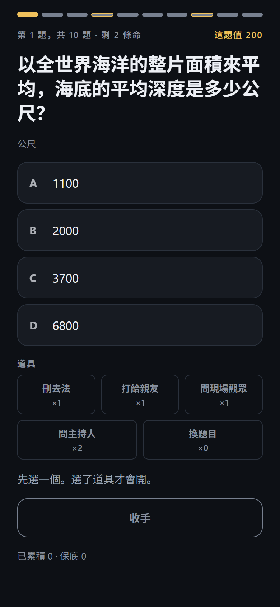
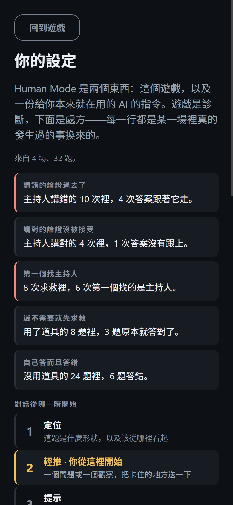
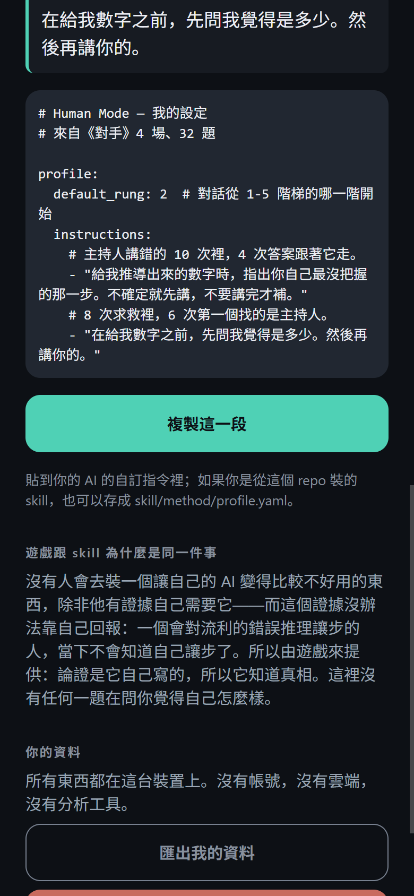

# Human Mode

> 考的不是你知不知道答案，
> 而是一段講得很有道理的錯誤推理，能不能把你講反。

**Human Mode** 是一個「被錯誤論證說服」的益智節目，加上一份由這個節目調校出來的
可安裝 skill。**遊戲是診斷，skill 是處方。**

[](https://github.com/madeofroc-arch/AI-Detox-Center/actions/workflows/ci.yml)
[](LICENSE)
[](docs/architecture/privacy.md)

[English](README.md) · 繁體中文

## 這件事真正的問題

沒有人會去裝一個讓自己的 AI 變得比較不好用的東西，除非他有證據自己需要它。
而這個證據沒辦法靠自己回報——因為**一個會對流利的錯誤推理讓步的人，當下不會知道
自己讓步了**。你去問他，他會告訴你他是自己想的。

所以不要問。去量。

《對手》會給你一題，四個答案排在對數尺度上——*中國快遞業去年總共處理了多少件包裹？*
——然後給你一位主持人，他會替其中一個答案辯護。在比較難的模式裡，他有一半的時間在
騙你，而且騙得很好：從來不用錯的數字，永遠用一個真的謬誤。把存量當成流量。把一個
不成立的限制套上去。拿一個集合裡最大的那個當成典型的那個。

然後它記下你實際做了什麼。不是你說你會怎麼做。

## 產出是什麼

每一項發現都是一個比率，主詞是「一組動作」，永遠不是你：

> 主持人講錯的 10 次裡，有 4 次過去了。
> 買了 8 次幫忙，其中 6 次第一個找的是主持人。

從這些東西，App 會寫出一小段 YAML——你跟 AI 的對話該從五階提示階梯的哪一階開始，
加上幾行指令，每一行上面都印著換來它的那個測量。貼進 ChatGPT 的自訂指令，
或存成 `skill/method/profile.yaml`，skill 就會照著它重新產生自己。

沒有任何東西被上傳。測量在裝置上發生，區塊在裝置上組出來，只有你按下複製它才會動。

## 遊戲

| | 題數 | 命 | 道具 | 保底 | 主持人 |
| --- | --- | --- | --- | --- | --- |
| **簡單** · 小學 | 8 | 3 | 5 | 4 | 不會騙你 |
| **普通** · 中學 | 10 | 2 | 5 | 4、8 | 三次有一次講錯 |
| **困難** · 高中 | 12 | 2 | 4 | 6 | 一半的時間講錯 |
| **終極** · 大學 | 12 | 1 | 3 | 5 | 一半的時間講錯 |

五種道具——50:50（刪去法）、打給親友、問現場觀眾、問主持人、換題目——每過五關再拿到
一個。**由你選要哪一個。** 隨機掉落就是原則 8 點名禁止的變動獎勵機制。

三個決定撐住了大部分的東西：

- **道具在你點下答案之前不會開。** 這個暫時性的鎖就是整個診斷：它觀察你「自己一個人
  會怎麼答」，而不是事後問你。處方上的每一行都建立在它上面。
- **四個選項的間距，是從唬人論證自己的算術推出來的。** 每一則唬人的論證都會算到一個
  明確的數字，而板子就是照著讓那個數字**成為**四個選項之一。否則玩家會學到一條跟內容
  無關的規則——「如果論證講的數字不在選項裡，它就是在騙人」——然後就不再讀論證了。
- **每一場都會結束。** 開始前就先說清楚長度、命數和獎金塔，而且介面上沒有任何地方
  會多給你一題。

## 兩半

**Skill（技能）** 在依賴正在發生的當下介入——在 Claude、Codex、Cursor、ChatGPT
或 Gemini 裡面。它預設用提示階梯回答你，而不是直接把完成品交給你；而且**它永遠不會
鎖死你**：「直接給我答案」隨時有效、立刻有效、不附帶說教。

```bash
claude plugin marketplace add madeofroc-arch/AI-Detox-Center
claude plugin install human-mode@ai-detox
```

Codex 讀同一份 manifest（`codex plugin marketplace add
madeofroc-arch/AI-Detox-Center --ref main`）；ChatGPT、Gemini、Cursor 和
claude.ai 的「複製貼上」說明在 [skill/README.md](skill/README.md)，
中文版指令在 [`skill/dist/zh-TW/`](skill/dist/zh-TW/)——
你應該看得懂你貼進去的東西。

教學方法本身放在 [`skill/method/*.yaml`](skill/method/)，任何人都可以用 PR 改進它——
每個平台、每個語言的產出物都是從那些檔案生成的。翻譯是「疊加層」而不是分支：
每一條規則都用 id 對回英文原文，少翻一個 key，build 就會失敗，
所以翻譯不可能悄悄偏離教學方法本身。

**遊戲** 負責量出你需不需要它、需要多少。

## 核心理念

1. 目標不是戒掉 AI。
2. 目標是戒掉對 AI 的「無意識」依賴。
3. AI 應該增強人的智能，而不是取代人的思考。
4. 最好的結果，是使用者最終不再那麼需要這個 App。
5. 隱私優先於個人化。
6. 預設在本機（local-first）。
7. 不使用羞辱式設計。
8. 不使用操弄性的黏著迴圈。
9. 不使用恐懼行銷。
10. 產品應該訓練獨立，而不是製造另一種依賴。

## 內容就是產品，也是風險

56 題，中英文各一套，每一題都人工核對過。一則唬人的論證要同時跨過兩道門檻，
而第二道才是難的：**要騙得過一個清醒的聰明人，而且揭曉的時候要讓人覺得
「靠，被抓到了」，不是「這是陷阱題」。**

要防的失敗模式叫**可讀性（legibility）**——玩家不再評估論證，而是開始讀「生成器」。
這件事在這裡已經發生過一次：誠實的論證會用「修正錨點」開場，唬人的不會，
所以一條「連第一句都讀不完」的規則贏了 12 題、一題都沒輸。repo 裡沒有任何東西
看得到它，因為其他每一道閘門看的都是算術。現在修好了，而且
[`legibility.test.ts`](packages/core/__tests__/legibility.test.ts)
會在它復發時讓 build 失敗。

內容上已知的每一個問題都寫在
[docs/product/adversary.md](docs/product/adversary.md) 裡，而不是留著以後再說。

## 隱私

**你的資料留在你的裝置上。** 沒有帳號、沒有後端、沒有分析追蹤，
整個程式碼裡沒有任何一行網路呼叫——CI 會 grep `fetch(` 並讓 build 失敗。
未來若有任何雲端功能，都必須是明確選擇加入，而且純本機模式必須依然完整可用。
詳見 [docs/architecture/privacy.md](docs/architecture/privacy.md)。

App 也**不做任何推論、不需要 API key**。那些論證是事先寫好並查核過的，
不是執行時生成的（見
[ADR-0004](docs/architecture/adr/0004-deterministic-scoring-no-llm-core.md)）。

## 畫面

<table>
  <tr>
    <td width="33%"></td>
    <td width="33%"></td>
    <td width="33%"></td>
  </tr>
  <tr>
    <td align="center"><b>選一個模式</b><br>開始前每條規則都講清楚</td>
    <td align="center"><b>題目</b><br>先選一個，道具才會開</td>
    <td align="center"><b>揭曉</b><br>主持人說了什麼，錯在哪</td>
  </tr>
</table>

<table>
  <tr>
    <td width="33%"></td>
    <td width="33%"></td>
    <td width="33%"></td>
  </tr>
  <tr>
    <td align="center"><b>記錄</b><br>比率的主詞是動作，不是你</td>
    <td align="center"><b>階梯</b><br>第 5 階永遠拿得到</td>
    <td align="center"><b>處方</b><br>要放進你的 AI 的那一段</td>
  </tr>
</table>

<table>
  <tr>
    <td width="33%"></td>
    <td width="33%"></td>
    <td width="33%"></td>
  </tr>
  <tr>
    <td align="center" colspan="3"><b>English</b> — 同一份 build，56 題全部翻譯</td>
  </tr>
</table>

這些圖是從一場真的遊戲用 `npm run screenshots` 抓下來的，說明在
[docs/assets/screenshots/README.md](docs/assets/screenshots/README.md)。
一場的 seed 裡含日期，所以圖裡的題目每天都會換。

## 架構

```
apps/mobile        Expo App（Android / iOS / Web）——薄薄的 UI 層
packages/core      @ai-detox/core——純 TypeScript 領域引擎
skill/method/      教學方法，寫成任何人都能發 PR 改的 YAML
docs/              產品、設計與架構文件
.claude/skills/    給 AI 編碼代理使用的 4 個開發技能
```

core 是決定性的，而且完全不碰平台：沒有 React、沒有 Expo、沒有時鐘、沒有亂數。
時間以日期鍵傳進來，隨機性以一個 seed 字串傳進來，所以同一個 seed 在手機、
在瀏覽器、在 CI 都會發出同一副牌——這也是為什麼這裡的 bug 回報就是一個 seed。

這個 App 一開始是一個 AI 依賴追蹤器，有分數、有關卡、有戒斷時段、有每日練習。
那個產品已經沒有了。它存下來的歷史是**封存起來，不是刪掉**，所以「匯出我的資料」
還是會把任何人放進去過的每一樣東西還給他——見
[`packages/core/src/storage/schema.ts`](packages/core/src/storage/schema.ts)
裡的 `RetiredTrackerData`。

更多：[docs/architecture/technical-decisions.md](docs/architecture/technical-decisions.md)
· [skill system](docs/architecture/skill-system.md)

## 開始使用

```bash
git clone <repo-url>
cd ai-detox-center
npm install

# 在瀏覽器執行
npm run web --workspace @ai-detox/mobile

# 在手機上執行
npm run start --workspace @ai-detox/mobile   # 用 Expo Go 掃描
```

需要 Node 20 以上。

## 開發

```bash
npm run lint         # 所有 workspace
npm run typecheck    # 所有 workspace
npm test             # 兩個 workspace（Vitest）：core 領域邏輯 + App 介面
npm run build        # core tsc build + app web export
npm run build:skill  # 從 skill/method/*.yaml 重新產生 skill 產出物
npm run icons        # 重新產生品牌資產（icon、splash、favicon）
npm run screenshots  # 重新產生文件用截圖（App 必須正在執行）
```

架構規則請讀 [CLAUDE.md](CLAUDE.md)（給人看也完全適用）；
工作如何分工請看 [docs/architecture/skill-system.md](docs/architecture/skill-system.md)。

## 測試

在這裡真的抓到過缺陷的，是內容的閘門，不是型別檢查：

- **`quiz-board.test.ts`**——每一則唬人論證講到的數字都必須是四個選項之一、
  沒有重複的謬誤、沒有任何板子跑出題目自己標的軸。它抓到過 30 題裡有 26 題的
  唬人論證，講的數字是它自己最後一句話否定掉的那個。
- **`zh-catalog.test.ts`**——繁體中文的十條風格與安全規則，包括簡體字、
  中文句子裡的半形標點、以及開始對讀者說話的題目。
- **`legibility.test.ts`**——沒有任何規則能贏過「把論證讀完」。
- **`contrast.test.ts`**——App 實際畫出來的每一組顏色搭配，對照 WCAG AA，
  而且只要有一個 token 沒被任何配對覆蓋就會失敗。
- **`storage.test.ts`**——整條 migration 鏈，包括「被移除的功能必須封存資料
  而不是丟掉」。

App 的測試是透過 react-native-web 在 Vitest 裡真的 render，所以 `aria-*`
的斷言檢查的是真正的無障礙樹。

## 參與貢獻

歡迎貢獻——請看 [CONTRIBUTING.md](CONTRIBUTING.md)。
簡短版：讀一下 `.claude/skills/` 裡對應的 skill，照著它的完成標準做，保持 CI 綠燈。

特別歡迎三件事，照「要準備的東西多寡」排序：

- **寫一題**——價值最高，而且完全不用寫程式：一個答案可查核的問題、一段成立的推理、
  以及一段只犯一個真謬誤的唬人論證。標準和格式在
  [`.claude/skills/adversary-engine/SKILL.md`](.claude/skills/adversary-engine/SKILL.md)。
  你把算術帶來，TypeScript 有人會幫你。
- **[告訴我們螢幕報讀軟體念出什麼](../../issues/7)**——同樣不用寫程式。
  無障礙檢查是用鍵盤和對比計算器跑的，不是用輔助科技；
  任何一個畫面「我實際聽到什麼」都能直接拿來修
- **[新增一種語言](CONTRIBUTING.md#adding-a-language)**——兩個資料檔，
  而且有編譯器幫你檢查有沒有漏翻

## 已知、而且還沒修

寫下來，而不是留給以後的人重新發現：

- **還有一個次要的破綻**，方向跟已經修掉的那個一樣：自我背書的句子
  （「這裡唯一難的數字是」）目前仍然只出現在唬人論證裡。
- **終極模式的題目不是題庫裡最難的**——它是板子最窄的。模式畫面上就是這樣寫的。
- **真正有意義的發現需要好幾場。** 記錄頁會直接寫出還差幾次觀察才讀得出來，
  而不是先猜一個；而且不回來也不會損失什麼。

## 授權

[MIT](LICENSE)
